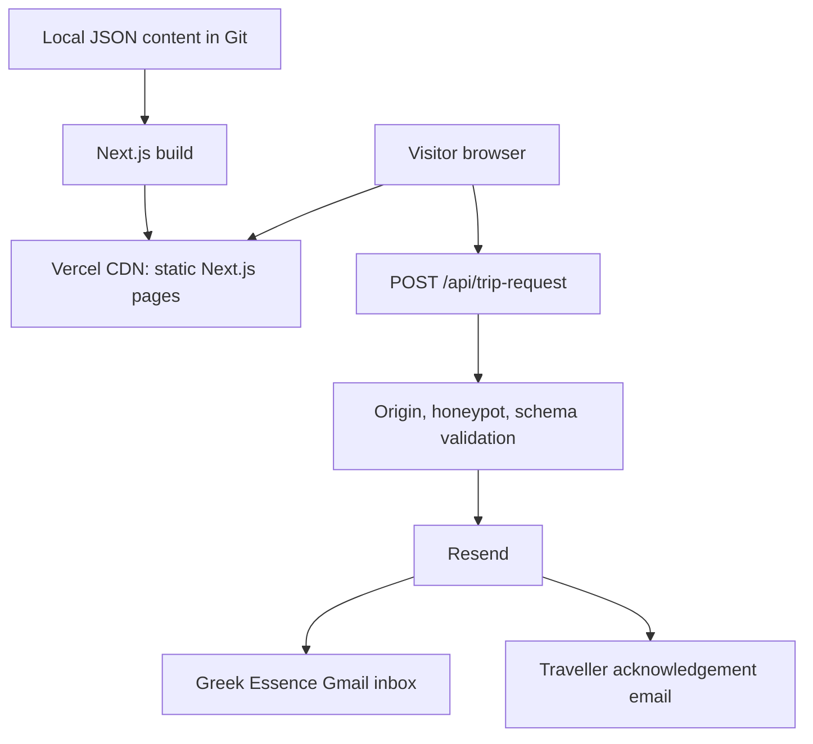

## 2. Recommended System Architecture

### 2.1 Architecture summary

The site is a single Next.js application. Vercel pre-renders and serves content from its CDN. A browser submits the custom form to a same-origin route handler. The handler validates the request, sends a full lead notification to the configured Google inbox, then sends a simple acknowledgement to the traveller through Resend. No submission data is stored by the application.

### 2.2 What is static and what is dynamic

| Concern | Implementation | Rendering/runtime |
|---|---|---|
| Pages, navigation, SEO, images | Next.js App Router and local JSON | Statically generated at build time |
| English/Greek paths | `next-intl` middleware and route params | Static locale pages |
| Form steps, conditional fields, draft persistence | Client component | Browser only |
| Form submission | `app/api/trip-request/route.ts` | Vercel server function, on demand |
| Lead notification and acknowledgement | Resend server SDK/API | Called only by the route handler |
| Content changes | Git change → Vercel deployment | Build/redeploy required |

### 2.3 Why this is the right prototype architecture

- It uses the stack selected for the desired UI quality.
- It permits a fully bespoke four-step form rather than an embedded third-party form.
- It keeps API keys private while retaining a nearly static deployment.
- It is cheap/free within the prototype plan limits.
- It keeps the production migration small: content and UI remain reusable when lead storage or a CMS is introduced.
- It avoids a database, queue, CMS, CRM, webhook chain, and monitoring stack before the owner approves the product direction.

### 2.4 Rejected prototype alternatives

| Alternative | Decision |
|---|---|
| Browser calls Resend directly | Rejected. It would expose a private API key and allow abuse. |
| Generic form-builder embed | Rejected. It weakens control over the approved UI, responsiveness, accessibility, and four-step experience. |
| Form service + autoresponder | Rejected for prototype. The free tiers do not meet the acknowledgement-email requirement without payment and add a separate UI/data provider. |
| Database/outbox/retry worker | Deferred. Correct for production reliability, excessive for an owner-review prototype. |
| CMS | Deferred. Local JSON is cheaper, simpler, reviewable in Git, and sufficient for curated prototype content. |
| SPA/client-only rendering | Rejected. It harms SEO, first load, and resilient content delivery. |

---

