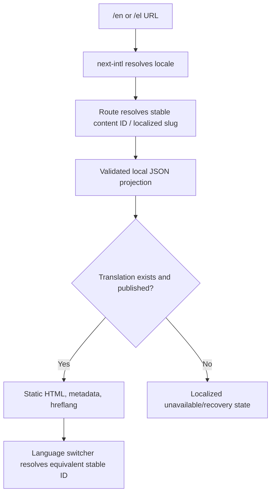

## 5. Routing, Rendering, and Localization

### 5.1 Route structure

```text
/{locale}
/{locale}/destinations
/{locale}/destinations/{localized-slug}
/{locale}/destinations/more-of-greece
/{locale}/experiences
/{locale}/experiences/{localized-slug}
/{locale}/journeys
/{locale}/journeys/{localized-slug}
/{locale}/about
/{locale}/how-it-works              # only if approved as a separate route
/{locale}/faq
/{locale}/contact
/{locale}/plan-my-trip
/{locale}/privacy
/{locale}/cookies
/{locale}/terms                     # only once legally approved
```

Supported locales are exactly `en` and `el`. Canonical public URLs use `/en/...` and `/el/...`. The root route redirects to `/en` by default, with optional browser-language preference only if it does not create an unpredictable experience. English remains the `x-default` alternate.

`next-intl` owns locale detection, middleware, localized navigation helpers, and message resolution. It must not translate editorial content dynamically.

### 5.2 Static rendering strategy

Every approved page is generated with `generateStaticParams` from local content. Dynamic detail routes return a localized 404 or C-30 unavailable/recovery state when a slug does not exist. Content changes require a Git commit and deployment. There are no runtime content calls, CMS webhooks, database queries, or dynamic personalization.

| Page type | Data source | Rendering | Fallback | SEO and analytics status |
|---|---|---|---|---|
| Home | locale page JSON + featured IDs | Static | Build fails when required content is absent | Indexable; analytics deferred |
| Destination/Experience/Journey indexes | typed local collections | Static | C-30 only for optional future collection | Indexable localized pages |
| Detail pages | localized entity JSON plus stable relation IDs | Static per slug | Localized 404/unavailable state | Indexable, linked, metadata generated |
| About/FAQ/Contact | localized page JSON | Static | Required missing content blocks build | Indexable when approved |
| Plan My Trip | static shell, client form island | Static shell + client interaction | Safe retry/error states | Indexable landing page |
| Legal pages | approved local JSON/MD content | Static | Block release if required | Indexable only as legal advice permits |
| Not-found/unavailable | local UI messages | Static | Recovery links | `noindex` |

### 5.3 English/Greek content resolution



Each destination, experience, and journey has a stable locale-neutral ID, one localized slug per language, and locale-specific editorial fields. The language switcher resolves by ID, never by translating a URL string. If an equivalent translation is missing, it says so and offers the available alternative rather than silently mixing languages.

### 5.4 URL, canonical, and language targeting rules

- One self-referencing canonical per indexable locale page.
- Emit `hreflang="en"`, `hreflang="el"`, and `hreflang="x-default"` only for published equivalents.
- Do not canonicalize Greek to English.
- Use lowercase, hyphenated slugs. Do not change published slugs without a one-hop redirect.
- `sitemap.ts` includes published, indexable local routes only; `robots.ts` points to it.
- Preview/demo-only pages, errors, unavailable translations, and no-data routes are `noindex`.
- Form data, names, emails, dates, budgets, and notes never appear in URLs or query strings.

---

