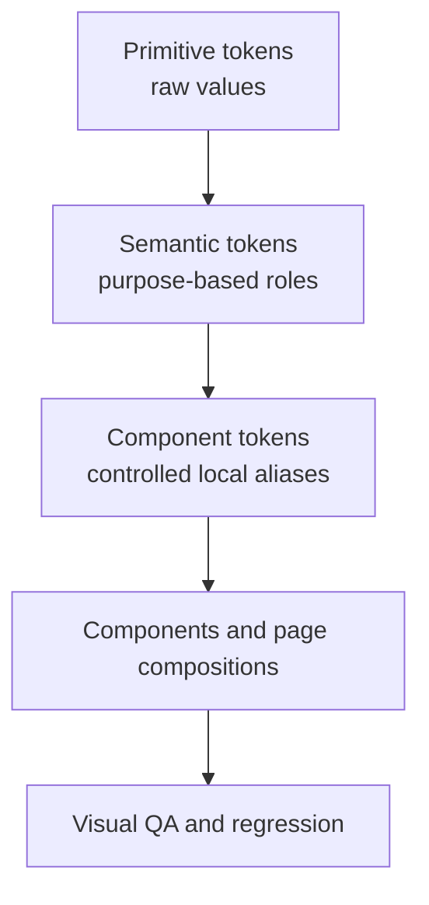

# Part II — Token Architecture

## 5. Token Hierarchy and Source-of-Truth Rules

All reusable visual decisions should resolve through tokens.

### 5.1 Token levels

| Level | Purpose | Example |
|---|---|---|
| Primitive | Raw reusable design values | `--ge-blue-800`, `--ge-space-6` |
| Semantic | Product meaning and role | `--color-background`, `--color-primary` |
| Component | Stable visual contract for a complex component | `--button-primary-bg`, `--hero-scrim` |
| Composition | Page-level use of semantic/component tokens | Home hero, destination cards |
| Utility mapping | Tailwind utility generation | `bg-primary`, `text-muted-foreground` |

### 5.2 Rules

- Page components must prefer semantic utilities such as `bg-background`, `text-foreground`, and `border-border`.
- Primitive color names must not be used directly in normal page composition.
- Component tokens are allowed only when semantic tokens cannot express a stable requirement.
- One-off values require a documented reason and should remain rare.
- Tokens are defined centrally in `app/globals.css` or an imported token file.
- Light mode is the sole prototype theme. Do not add unused dark-theme values.
- Token names describe purpose, not appearance.
- A token change must be evaluated across English and Greek layouts, all states, and representative photography.

---

